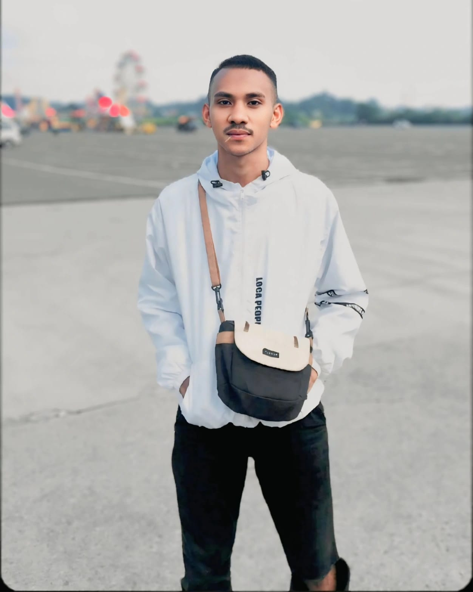

<html class="scroll-smooth" lang="id">
 <head>
  <meta charset="utf-8"/>
  <meta content="width=device-width, initial-scale=1" name="viewport"/>
  <title>
   Cave Rival - Aplikasi Kafe Unik
  </title>
  
  <link href="https://fonts.googleapis.com/css2?family=Poppins:wght@400;600&amp;display=swap" rel="stylesheet"/>
  <link href="https://cdnjs.cloudflare.com/ajax/libs/font-awesome/5.15.3/css/all.min.css" rel="stylesheet"/>
  
 </head>
 <body class="bg-gray-50 min-h-screen flex flex-col">
  <!-- Header / Navbar -->
  <header class="bg-gray-900 text-yellow-400 sticky top-0 z-50 shadow-lg">
   

    

     
     <h1 class="text-2xl font-extrabold tracking-wide">
      Cave Rival
     </h1>
    

    <nav class="hidden md:flex space-x-8 font-semibold">
     <a class="hover:text-yellow-300 transition" href="#menu">
      Menu
     </a>
     <a class="hover:text-yellow-300 transition" href="#plafon">
      Plafon
     </a>
     <a class="hover:text-yellow-300 transition" href="#reservasi">
      Reservasi
     </a>
     <a class="hover:text-yellow-300 transition" href="#tentang">
      Tentang
     </a>
     <a class="hover:text-yellow-300 transition" href="#kontak">
      Kontak
     </a>
    </nav>
    <button aria-label="Toggle menu" class="md:hidden text-yellow-400 focus:outline-none" id="btn-menu">
     <i class="fas fa-bars fa-lg">
     </i>
    </button>
   

   <nav class="md:hidden bg-gray-900 text-yellow-400 border-t border-yellow-700 hidden flex-col space-y-2 px-4 pb-4" id="mobile-menu">
    <a class="block py-2 hover:text-yellow-300 transition font-semibold" href="#menu">
     Menu
    </a>
    <a class="block py-2 hover:text-yellow-300 transition font-semibold" href="#plafon">
     Plafon
    </a>
    <a class="block py-2 hover:text-yellow-300 transition font-semibold" href="#reservasi">
     Reservasi
    </a>
    <a class="block py-2 hover:text-yellow-300 transition font-semibold" href="#tentang">
     Tentang
    </a>
    <a class="block py-2 hover:text-yellow-300 transition font-semibold" href="#kontak">
     Kontak
    </a>
   </nav>
  </header>
  <!-- Hero Section -->
  <section class="container mx-auto px-6 py-20 flex flex-col md:flex-row items-center gap-12">
   

    <h2 class="text-5xl font-extrabold text-gray-900 mb-6">
     Selamat Datang di Cave Rival
    </h2>
    

     Kafe unik dengan konsep gua dan plafon artistik yang memukau. Nikmati kopi dan hidangan spesial kami dalam suasana yang berbeda dari yang lain.
    

    <a class="inline-block bg-yellow-500 text-white font-semibold px-8 py-3 rounded-full shadow-lg hover:bg-yellow-600 transition" href="#menu">
     Jelajahi Menu
    </a>
   

   

    
   

  </section>
  <!-- Menu Section -->
  <section class="container mx-auto px-6 py-16" id="menu">
   <h3 class="text-4xl font-bold text-gray-900 mb-12 text-center">
    Menu Andalan Cave Rival
   </h3>
   

    <article class="bg-white rounded-xl shadow-md hover:shadow-xl transition overflow-hidden">
     
     

      <h4 class="text-xl font-semibold text-yellow-600">
       Espresso Gua
      </h4>
      

       Kopi hitam pekat dengan aroma kuat, disajikan dengan gaya gua yang unik.
      

      

       Rp 20.000
      

     

    </article>
    <article class="bg-white rounded-xl shadow-md hover:shadow-xl transition overflow-hidden">
     
     

      <h4 class="text-xl font-semibold text-yellow-600">
       Cappuccino Batu
      </h4>
      

       Kopi susu berbusa lembut dengan sentuhan rasa coklat yang hangat.
      

      

       Rp 28.000
      

     

    </article>
    <article class="bg-white rounded-xl shadow-md hover:shadow-xl transition overflow-hidden">
     
     

      <h4 class="text-xl font-semibold text-yellow-600">
       Latte Stalaktit
      </h4>
      

       Latte dengan seni busa menyerupai stalaktit gua, rasa lembut dan creamy.
      

      

       Rp 30.000
      

     

    </article>
    <article class="bg-white rounded-xl shadow-md hover:shadow-xl transition overflow-hidden">
     
     

      <h4 class="text-xl font-semibold text-yellow-600">
       Americano Gua
      </h4>
      

       Kopi hitam yang diseduh dengan air panas, rasa ringan dan segar dengan nuansa gua.
      

      

       Rp 22.000
      

     

    </article>
    <article class="bg-white rounded-xl shadow-md hover:shadow-xl transition overflow-hidden">
     
     

      <h4 class="text-xl font-semibold text-yellow-600">
       Mocha Gua
      </h4>
      

       Perpaduan kopi, coklat, dan susu yang manis dan pahit, cocok untuk suasana gua.
      

      

       Rp 32.000
      

     

    </article>
    <article class="bg-white rounded-xl shadow-md hover:shadow-xl transition overflow-hidden">
     
     

      <h4 class="text-xl font-semibold text-yellow-600">
       Teh Tarik Gua
      </h4>
      

       Teh susu manis dengan busa lembut khas Asia Tenggara, nikmat di suasana gua.
      

      

       Rp 18.000
      

     

    </article>
   

  </section>
  <!-- Plafon Section -->
  <section class="bg-gray-900 text-yellow-400 py-20 px-6" id="plafon">
   

    <h3 class="text-4xl font-extrabold mb-12 text-center">
     Fitur Plafon Artistik Cave Rival
    </h3>
    

     

      
      <h4 class="text-xl font-semibold mb-2">
       Lampu Gantung Stalaktit
      </h4>
      

       Lampu gantung unik menyerupai stalaktit gua yang memberikan pencahayaan hangat dan dramatis.
      

     

     

      
      <h4 class="text-xl font-semibold mb-2">
       Tekstur Batu Alami
      </h4>
      

       Plafon dengan tekstur batu alami yang memberikan kesan gua asli dan suasana hangat.
      

     

     

      
      <h4 class="text-xl font-semibold mb-2">
       Efek Cahaya Dinamis
      </h4>
      

       Lampu dengan efek cahaya dinamis yang memantul di plafon, menciptakan suasana magis dan cozy.
      

     

    

    

     
    

   

  </section>
  <!-- Reservasi Section -->
  <section class="container mx-auto px-6 py-16" id="reservasi">
   <h3 class="text-4xl font-bold text-gray-900 mb-10 text-center">
    Reservasi Meja
   </h3>
   

    <form class="space-y-6" id="formReservasi">
     

      <label class="block font-semibold text-gray-700 mb-2" for="nama">
       Nama Lengkap
      </label>
      <input class="w-full border border-gray-300 rounded-md px-4 py-2 focus:outline-yellow-500 focus:ring-2 focus:ring-yellow-300" id="nama" name="nama" placeholder="Masukkan nama lengkap" required="" type="text"/>
     

     

      <label class="block font-semibold text-gray-700 mb-2" for="email">
       Email
      </label>
      <input class="w-full border border-gray-300 rounded-md px-4 py-2 focus:outline-yellow-500 focus:ring-2 focus:ring-yellow-300" id="email" name="email" placeholder="Masukkan email" required="" type="email"/>
     

     

      <label class="block font-semibold text-gray-700 mb-2" for="tanggal">
       Tanggal Reservasi
      </label>
      <input class="w-full border border-gray-300 rounded-md px-4 py-2 focus:outline-yellow-500 focus:ring-2 focus:ring-yellow-300" id="tanggal" name="tanggal" required="" type="date"/>
     

     

      <label class="block font-semibold text-gray-700 mb-2" for="waktu">
       Waktu
      </label>
      <select class="w-full border border-gray-300 rounded-md px-4 py-2 focus:outline-yellow-500 focus:ring-2 focus:ring-yellow-300" id="waktu" name="waktu" required="">
       <option disabled="" selected="" value="">
        Pilih waktu
       </option>
       <option value="10:00">
        10:00 WIB
       </option>
       <option value="12:00">
        12:00 WIB
       </option>
       <option value="14:00">
        14:00 WIB
       </option>
       <option value="16:00">
        16:00 WIB
       </option>
       <option value="18:00">
        18:00 WIB
       </option>
       <option value="20:00">
        20:00 WIB
       </option>
      </select>
     

     

      <label class="block font-semibold text-gray-700 mb-2" for="jumlah">
       Jumlah Orang
      </label>
      <input class="w-full border border-gray-300 rounded-md px-4 py-2 focus:outline-yellow-500 focus:ring-2 focus:ring-yellow-300" id="jumlah" max="20" min="1" name="jumlah" placeholder="Masukkan jumlah orang" required="" type="number"/>
     

     <button class="w-full bg-yellow-600 text-white font-semibold py-3 rounded-full hover:bg-yellow-700 transition" type="submit">
      Pesan Sekarang
     </button>
    </form>
    

     Terima kasih! Reservasi Anda telah diterima.
    

   

  </section>
  <!-- Tentang Section -->
  <section class="container mx-auto px-6 py-16" id="tentang">
   <h3 class="text-4xl font-bold text-gray-900 mb-10 text-center">
    Tentang Cave Rival
   </h3>
   

    

     
    

    

     

      Cave Rival adalah kafe dengan konsep unik yang menggabungkan suasana gua alami dan desain plafon artistik yang memukau. Kami berdedikasi memberikan pengalaman ngopi yang berbeda dan tak terlupakan.
     

     

      Dengan pilihan kopi premium dan menu makanan ringan yang lezat, kami mengundang Anda untuk menikmati waktu santai dalam suasana yang cozy dan eksklusif.
     

    

   

  </section>
  <!-- Kontak Section -->
  <section class="bg-gray-900 text-yellow-400 py-16 px-6" id="kontak">
   

    <h3 class="text-4xl font-extrabold mb-10 text-center">
     Hubungi Kami
    </h3>
    

     

      

       <i class="fas fa-map-marker-alt text-yellow-500 text-2xl">
       </i>
       

        Jl. Gua Batu No. 77, Jakarta Selatan, Indonesia
       

      

      

       <i class="fas fa-phone-alt text-yellow-500 text-2xl">
       </i>
       

        +62 811 2233 4455
       

      

      

       <i class="fas fa-envelope text-yellow-500 text-2xl">
       </i>
       

        contact@caverival.id
       

      

      

       <i class="fas fa-clock text-yellow-500 text-2xl">
       </i>
       

        Senin - Minggu: 09.00 - 23.00 WIB
       

      

     

     <form class="space-y-6 bg-gray-800 rounded-xl shadow-lg p-8 text-yellow-400" id="formKontak">
      

       <label class="block font-semibold mb-2" for="namaKontak">
        Nama
       </label>
       <input class="w-full rounded-md px-4 py-2 bg-gray-900 border border-yellow-600 focus:outline-yellow-400 focus:ring-2 focus:ring-yellow-400 text-yellow-400" id="namaKontak" name="namaKontak" placeholder="Masukkan nama Anda" required="" type="text"/>
      

      

       <label class="block font-semibold mb-2" for="emailKontak">
        Email
       </label>
       <input class="w-full rounded-md px-4 py-2 bg-gray-900 border border-yellow-600 focus:outline-yellow-400 focus:ring-2 focus:ring-yellow-400 text-yellow-400" id="emailKontak" name="emailKontak" placeholder="Masukkan email Anda" required="" type="email"/>
      

      

       <label class="block font-semibold mb-2" for="pesan">
        Pesan
       </label>
       <textarea class="w-full rounded-md px-4 py-2 bg-gray-900 border border-yellow-600 focus:outline-yellow-400 focus:ring-2 focus:ring-yellow-400 text-yellow-400 resize-none" id="pesan" name="pesan" placeholder="Tulis pesan Anda" required="" rows="4"></textarea>
      

      <button class="w-full bg-yellow-600 text-gray-900 font-semibold py-3 rounded-full hover:bg-yellow-700 transition" type="submit">
       Kirim Pesan
      </button>
      

       Terima kasih! Pesan Anda telah terkirim.
      

     </form>
    

   

  </section>
  <!-- Footer -->
  <footer class="bg-gray-900 text-yellow-400 py-6 mt-auto">
   

    

     © 2024 Cave Rival. Semua hak cipta dilindungi.
    

    

     <a aria-label="Facebook" class="hover:text-yellow-300 transition" href="#">
      <i class="fab fa-facebook fa-lg">
      </i>
     </a>
     <a aria-label="Instagram" class="hover:text-yellow-300 transition" href="#">
      <i class="fab fa-instagram fa-lg">
      </i>
     </a>
     <a aria-label="Twitter" class="hover:text-yellow-300 transition" href="#">
      <i class="fab fa-twitter fa-lg">
      </i>
     </a>
    

   

  </footer>
  
 </body>
</html> 
